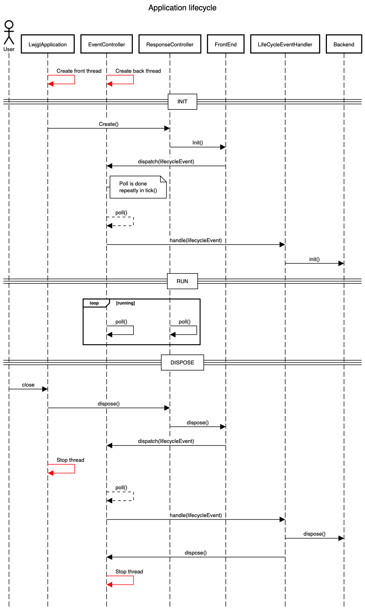

_[Version française ici](#documentation-technique)_

# Technical documentations

Wiki page:

- [Structure](https://github.com/Foacs/ribz/wiki/structure)

## Class diagram

Both `EventController` and `ResponseController` are `MessageListener`, meaning that they can receive
a `Message` (with method `dispatchMessage(message)`).

When they receive a message, they store it in a queue. Every tick, they get the message with the
highest priority from the queue and process it.

## Sequence diagram: Application's lifecycle

_**Bellow: French version**_

# Documentation technique

Page wiki:

- [Structure](https://github.com/Foacs/ribz/wiki/structure)

## Diagramme de classe

`EventController` et `ResponseController` sont tous les deux des `MessageListener`, ce qui signifie
qu'ils peuvent recevoir un `Message` (avec la méthode `dispatchMessage(message)`).

Quand ils reçoivent un message, ils le stockent dans une file. Chaque tick, ils récupèrent le
message avec la priorité la plus élevée de la file et le traitent.

## Diagramme de séquence : Cycle de vie de l'application

